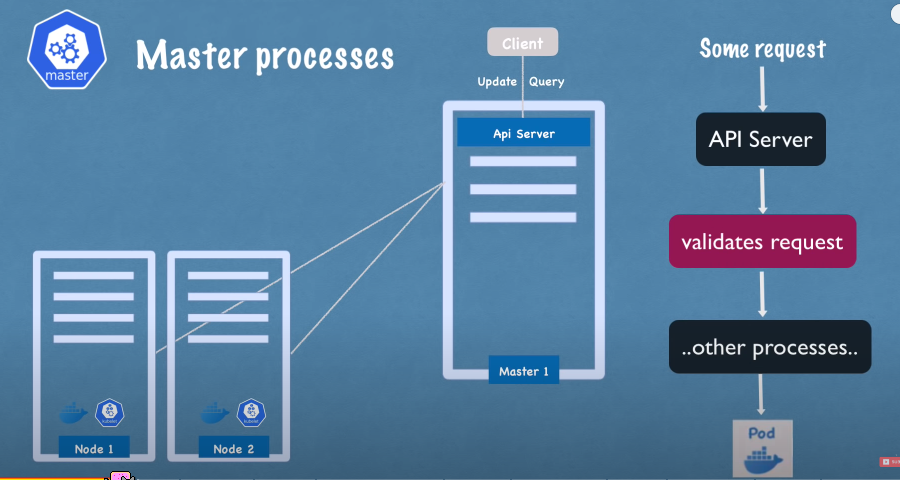
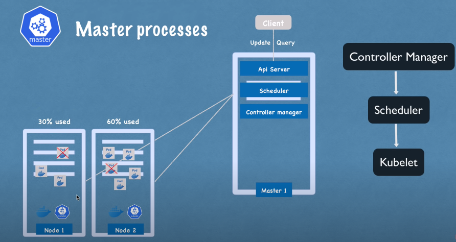
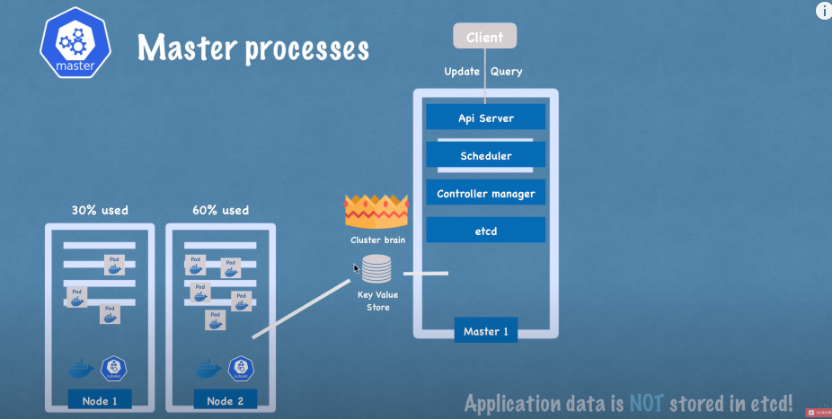
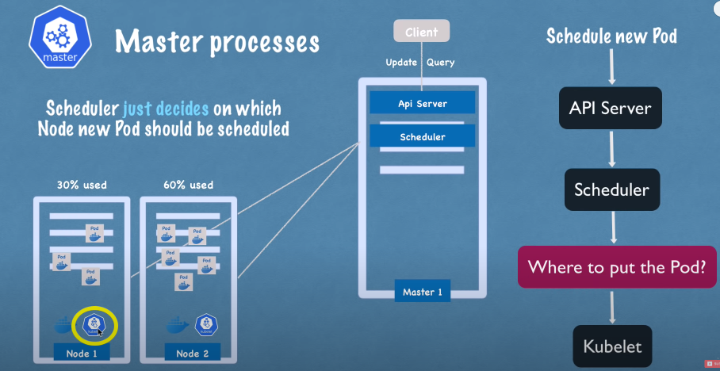

# YAML

- YAML is a data serialization language like JSON, XML
- Stand for YAML Ain't Markup Language, extension (.yaml and .yml)
- Human readable &rarr; very popular in configuration
- If we want to pass special character in string like \n, \t. We must put string into a double quoutes or single quoute.
- We can also comment in .yaml (#)
- If we want to have a multiline string, we can put each sentences in one line and use the | character behind the key, YAML will regconize and treat them as a multiline string. In case we want single line use (>) instead.
- We use $ sign to use environment variable inside yaml file.
- YAML also support placeholder by using ({{placeholder}}) sign.
- We can separate yaml file by using   --- in case we want multiple components for one service and we want to group them in one single file.

# Kubernetes

- Is an open source container orchestration tool, developed by Google.
- Problems:
  - Support microservices
  - Increase usage of containers
  &rarr; Demand for a proper way of managing those hundreds of containers.
- Features:
  - Help us to manage containerized applications in different deployment environments
  - High availability or no down time.
  - Scalability or high performance.
  - Disaster recovery - backup and restore.

## Components

- Kubernetes cluster consists of a set of worker machine called nodes that run containerized application.
- Every cluster has at least one node.

### Control plane components

- Control plane components make global decisions about the cluster (scheduling) as well as detecting and responsding to cluster events (like start new pod when replica is unstaisfied).
- Control plane can run on any machine in a cluster
- kube-apiserver: API server is a component of the Kubernetes control plane that exposes the kuber API. This is the frontend for Kubernetes control plane. The main implementation of Kuber API server is kube-apiserver. kube-apiserver is designed to scale horizontally which mean scale by deploying more instances. This is the entrypoint to K8s cluster
  
  
  
- kube-controller-manager: run controller processes and detect cluster state changes. Logically, each controller is a separate process, but to reduce complexity, they are all compiled into a single binary and run in a single process. Some types of these controllers are:
  - Node controller: responsible for noticing and responding when nodes go down
  - Job controller: watches for job objects that represent one-off tasks, then create Pods to run those tasks to completion.
  - EndpointSlice controller
  - ServiceAccount controller

- etcd: consistend and highly-available key value store used as Kuber backing store for all cluster data. It also called cluster brain because it stores all the information about the cluster. ***Application data is not stored in etcd***.
  
  
  
- kube-scheduler: component that watches for newly created Pods with no assigned node, and select a node for them to run on.  Scheduler is not responsible for placing pods on nodes, or binding pods to nodes. It is responsible for making scheduling decisions.

### Node components

- Node is a simple server virtual or physical machine and the basic or smallest unit of kubernetes is a Pod.
- kubelet: an agent that runs on each node in the cluster. It makes sure that containter are running in a Pod. The kubelet doesn't manage containers which were not created by Kubernetes.
- kube-proxy: a network proxy that runs on each node in our cluster. It maintain network rule on nodes. These rules allow network communication to our Pods from network sessions inside or outside our cluster.

### Virtual network

- Virtual network turn all the nodes inside of a cluster into one powerful machine that has the sum of all the resources of individual nodes.
- Worker nodes:
  - Higher workload, much bigger and more resources
- Control plane nodes (master nodes): 
  - Handful of master processes
  - much more important because if we can't access the master node, we will node able to access the cluster anymore and that mean we have to have a backup of our master node at anytime so in production environment we should have at least 2 master node inside of our kubernetes cluster

### Node and Pod 

- Node (worker node) is a simple server virtual or physical machine and the basic or smallest unit of kubernetes is a Pod.
- Pod create this running environment or a layer on top of the container. The reason why kubernetes want to abstract away the container runtime or container technologies so that we can replace them if we want to. And we only need to focus on working with Kubernetes layer.
- Usually, 1 application per pod. We can actually run multiple container inside a pod.
- Kubernetes support a virtual network which mean each pod has its IP address ***but not the container***
- Each Pods has its own IP address and its not public. New IP address on re-creation.

### Service and Ingress

- Service is basically a static ip address or permanent IP address that can be attached to each pod so the app will have its own service and the database will have its own service too.
- The lifecycle of Pod and Service are not connected. So in the case our app connect to the database, and when the database die &rarr; our endpoint is recreated and it is not updated inside the my-app pod. So with the help of Service, we don't have to change that database endpoint anymore.
- When we want our app accessible through the browser, we need to use the External Service.
- External Service is the service that open the communication from external sources.
- And when we don't want our database accessible from browser, we need to use Internal Service.
- **We must specify the type of Service on creation and Internal Service is the default type**
- But with the External Service, our endpoint to access the my-app application will look like: http://10.11.1.1:8080
- We always want our URL look like: http://my-app.com &rarr; Ingress. 
- Actually, the request will first go to the Ingress and it does the forwarding then to the Service

### Config Map and Secret

- Pods communicate with each other using a Service. 
- Example: our app connect to the database, and the database config we usually put it into the .env or the application.properties file. So when the database url change, we need to update the database config inside the application, rebuild the image &rarr; Push it into repo &rarr; Pull it in your Pod &rarr; restart the whole thing.
- To solve that problem, Kubernetes support the Config Map component. It is the external configuration of our application. So we just need connect Config Map to the pod and then the pod actually gets the data that config inside the Config Map.
- But Config Map is for non-confidential data only. 
- Kubernetes has another component called Secret to store secret data credential and encoded in Base64 format. But the built-in security machanism is not enabled by default. Secret component by default store unencrypted in the API server underlying data store (etcd). Anyone with access to etcd can retrirve or modify Secret.
- In order to safely use Secret, we can:
  - Enable Encryption at Rest for secret.
  - Enable or configure RBAC rules that restrict reading data inside Secret.
- Inside our application pod we can use Secret or Config Map variable as environment variables or as a properties file.

### Volumes

- Like volume in docker.
- What it actually does is attach a physical storage on a hard drive to our pod and that storage could be either on a local machine where the pod is running or it could be on a remove storage meaning of outside the current cluster (external reference to that volume).
- Kubernetes cluster doesn't manage any data persistance.

### Deployment and StatefulSet

- Suppose our application is running correctly and we can access the application from browser through the https://my-app.com.
- When application pod dies, crash or we have to restart the pod because we build the new container image. So we will have down time here because user can't reach our application which is realy bad experience.
- So instead of just using one node to hold the my-app application and datase, we can replicate everything so we would have another node to be a replica or clone of our application. And these node also connect to the Service.

  

- Service is also a load balancer which mean the service will actually catch the request and forward to whichever part that is least busy to handle this request.
- To create a replica node. Instead of create a second part but we will define a blueprint for Pods and specify how many replicas you want to have.
- And that component or that blueprint is called **Deployment** which is another component of Kubernetes and in practice we won't working with pod or we won't creating pod. Instead, we will create a deploymnents specify how many replicas you want to scale up or scale down the number of replicas of pods we need.
- So Pod is the abstraction of containers and Deployment is abstraction of Pods. And we will work with Deployment more than with Pods.
- Database can't be replicated via Deployment because database has a state which is its data. Meaning that if we have clones or replicas of the database, they would all need to access the same shared data storage, and we need some mechanism to handle this case to avoid insconsistency data.
- Kubernetes offer another component called Statefulset.
- This component specially for application like databases or any other stateful applications. Which means that database should be created by the StatefulSet instead of Deployment.
- In short, Deployment is for **stateLESS** apps. StatefulSet is for **stateFull** apps or databases.
- The StateFull Component work like the Deployment and make sure that all the database pod are synchronized so that no database inconsistencies.
- Deploying StatefulSet is not easy, so we often deploy database outside of the Kubernetes and we just have deployment part inside Kubernetes.

## K8s Architecture

### Worker node (Node)

- Worker node has multiple Pods on it.
- Worker nodes do the actual work of running the containers.
- 3 main components of worker node:
  - Kubelet: agent that runs on each node in the cluster. It makes sure that containers are running in a pod and interacts with both the container and node.
  - Kube-proxy: network proxy that runs on each node in the cluster. It maintains network rules on nodes. These network rules allow network communication to your Pods from network sessions inside or outside of your cluster. And it also load balances network traffic across multiple Pods and make sure that the traffic is routed in efficient way.
  - Container runtime: the software that is responsible for running containers.

### Master node (Control plane)

- Master node is responsible for managing the cluster state and the worker nodes.
- So whenever we create a new request like create a new pod, service... Master node will take care of that request and make sure that the request is fulfilled.
- This is the only one entry point to the cluster.

## Configuration

- Configuration in Kubernetes can in JSON or Yaml format and in declarative.
- Each configuration file consists of 3 parts
  - Metadata
  - Specification
  - Status: automatically generated and added by Kubernetes. (Kubernetes will compare the desired state with the actual state &rarr; self-healing feature)
  - The status of any kubernetes component is hold by etcd.

## Minikube and kubectl

- It is a tool that help us to run Kubernetes locally on our machine.
- Master node and worker node are running on the same machine.
- Kubectl is a command line tool to interact with Kubernetes cluster.
- Minikube has Docker pre-installed to run the containers in the cluster. 
- When we use Docker as a driver for Minikube, it will create a Docker container to run the Kubernetes cluster and Minikube will be hosted in our local machine &rarr; 2 layer of Docker.
  - Minikube runs as Docker container
  - Docker inside Minikube to run our application containers.

## Practice

